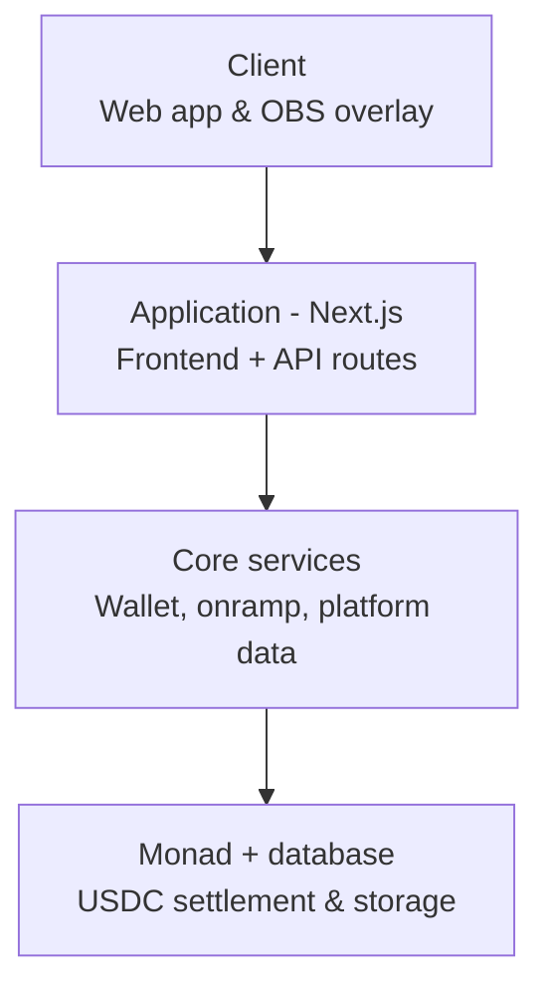
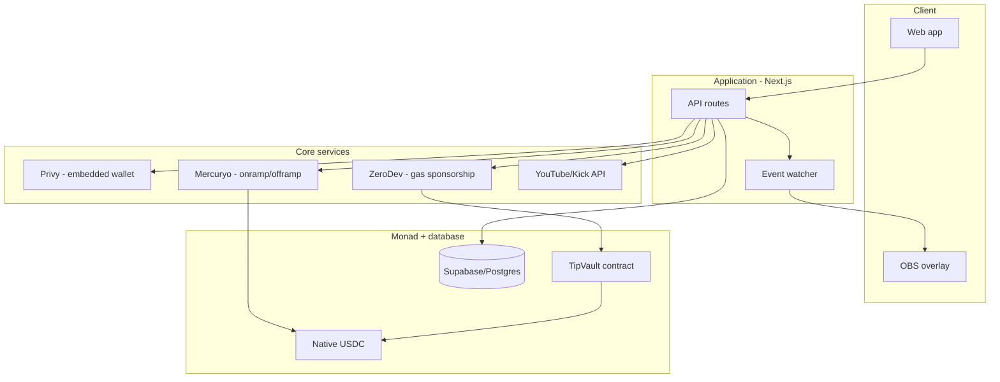
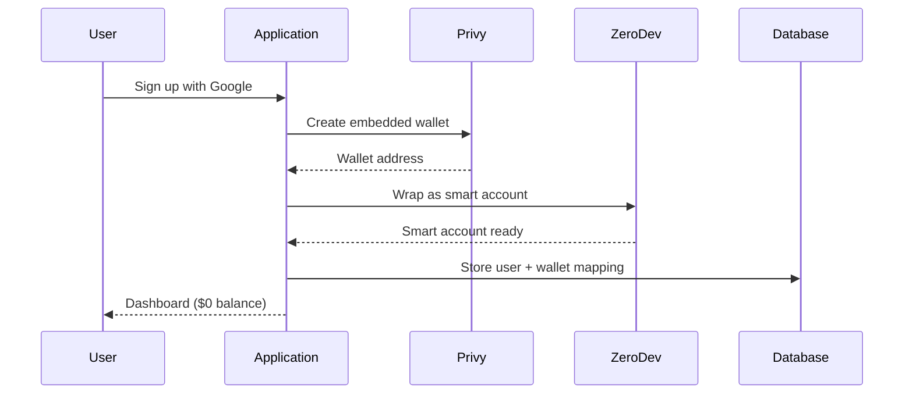
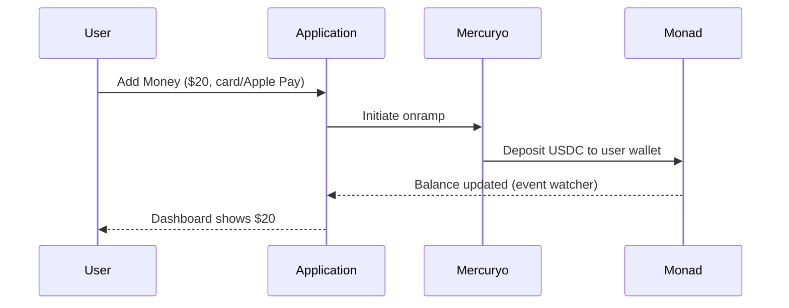
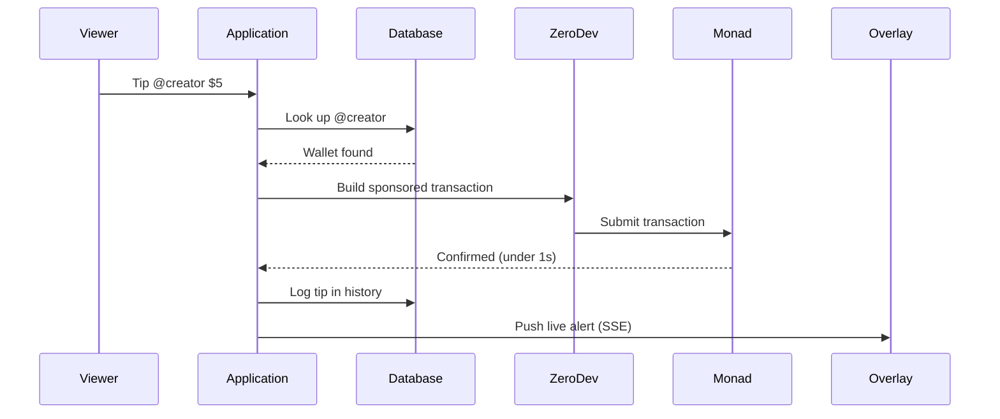
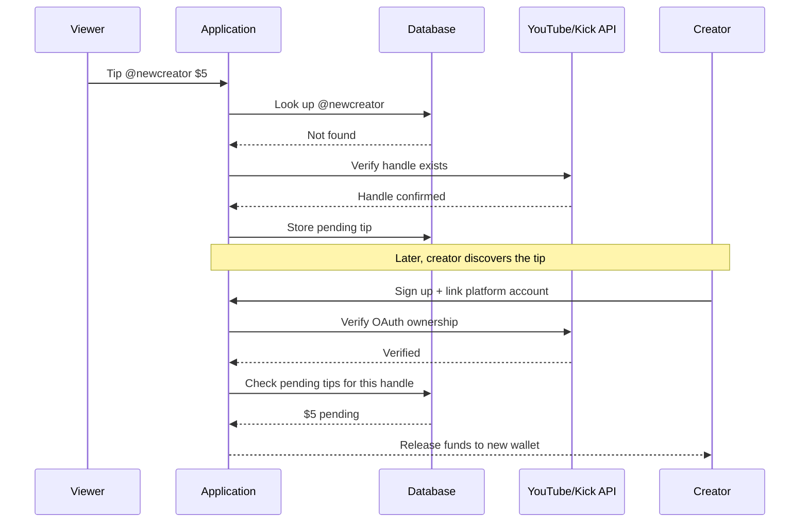
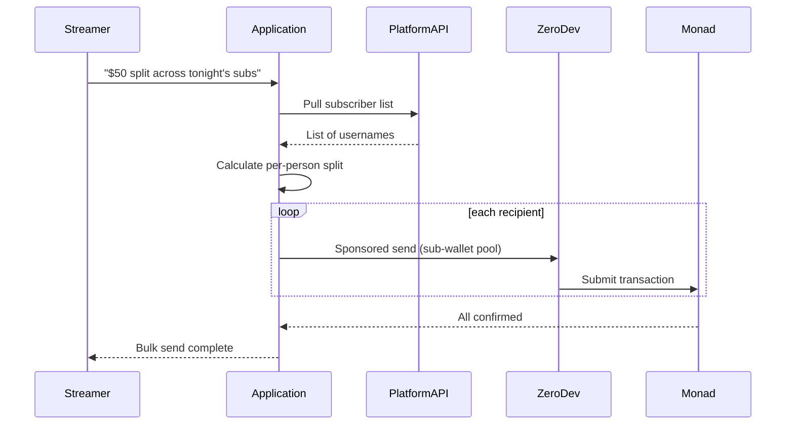
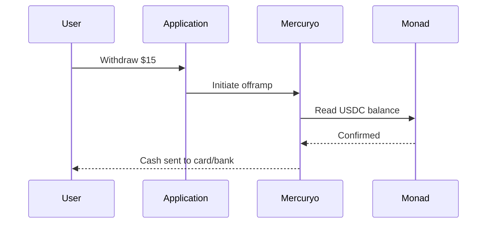
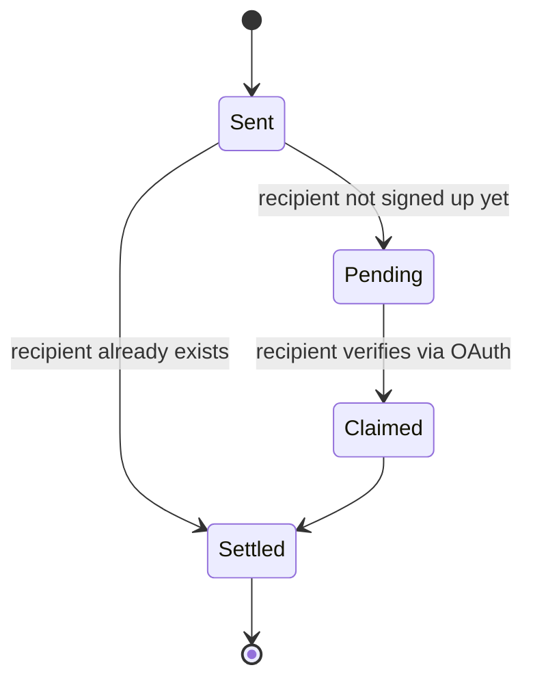
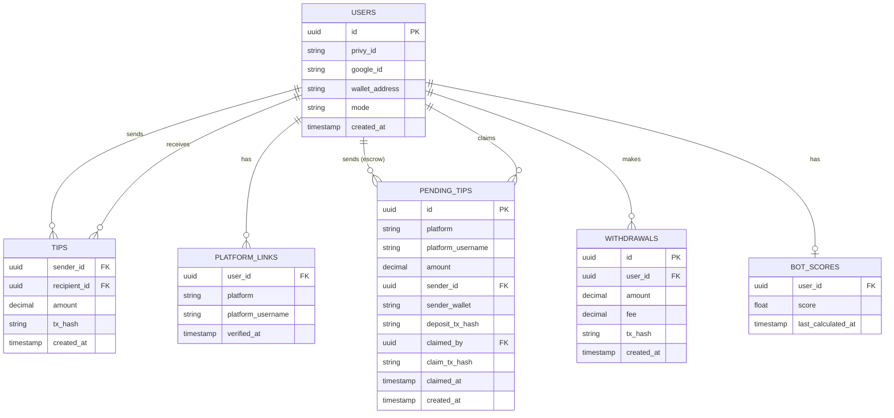

# System Architecture

**Project name:** dripp
**Chain:** Monad (mainnet) · **Asset:** native USDC

---

## 1. High-level overview

Four layers, top to bottom: the surfaces a user actually sees, the single application hub everything routes through, the three external services that hub calls, and the settlement/storage layer underneath.

## 2. Detailed component view

This is the same four layers, broken into the actual pieces referenced throughout the flows below.

---

## 3. Layer descriptions

### Client
- **Web app** — the main product surface: sign-up, wallet balance, tip/withdraw, history, and the Creator Mode dashboard.
- **OBS overlay** — a separate, lightweight page (e.g. `/overlay/[username]`) added as a browser source in OBS. No navigation, no buttons — it only listens for events and renders tip alerts.

### Application (Next.js)
The single hub everything routes through. The client never calls Privy, Mercuryo, or the platform APIs directly — only the Application layer does. Responsibilities: auth sessions (Google + platform OAuth), the tip-send endpoint, the event watcher (polls/subscribes to Monad, pushes to the overlay), and username resolution (own database first, one live platform API call only when needed).

### Core services
- **Wallet + gas (Privy + ZeroDev)** — creates the embedded wallet at sign-up and wraps it as a smart account capable of sponsored (gasless) transactions.
- **Onramp/offramp (Mercuryo)** — converts card/Apple Pay deposits into USDC on Monad, and reverses that for withdrawals.
- **Platform data (YouTube/Kick APIs)** — OAuth verification for Creator Mode, live sub counts, and single-username lookups for the tip-before-signup flow.

### Monad + database
- **Monad** — the settlement layer: the `TipVault` contract and native USDC transfers.
- **Database (Supabase/Postgres)** — everything off-chain: user records, platform-username-to-wallet mappings, pending tips, cached bot/real scores, and history for fast display.

---

## 4. Key flows

### 4.1 Sign-up

### 4.2 Deposit (onramp)

### 4.3 Tip a signed-up user

### 4.4 Tip an unclaimed username, then claim

### 4.5 Bulk / rule-based send

### 4.6 Withdraw (offramp)

---

## 5. Pending tip lifecycle

---

## 6. Database schema

---

## 7. Smart contract surface (kept intentionally thin)

A single `TipVault` contract handles:
- Direct transfers (a thin wrapper, mostly for onchain traceability)
- Holding pending tips for unclaimed usernames until a claim transaction — triggered by the backend once OAuth verification succeeds — releases them

Everything else (bulk-send batching, bot scoring, history) stays off-chain in the database, since none of it needs to be trustless to work for a hackathon submission — only the actual movement of money needs to be onchain.

---

## 8. Reference tech stack

| Layer | Tool |
|---|---|
| Login + wallet | Privy |
| Gas sponsorship / smart account | ZeroDev |
| Chain library | viem (+ wagmi in React) |
| Contracts | Solidity + Foundry |
| Payment rail | Monad MPP SDK / x402 facilitator |
| Onramp/offramp | Mercuryo |
| Frontend | Next.js + Tailwind |
| Overlay real-time | Server-Sent Events (or Pusher/Ably) |
| Backend | Next.js API routes |
| Database | Supabase (Postgres) |
| OAuth | NextAuth.js / Auth.js |
| Platform data | YouTube Data API (`forHandle`), Kick public API |
| Hosting | Vercel + Supabase |
